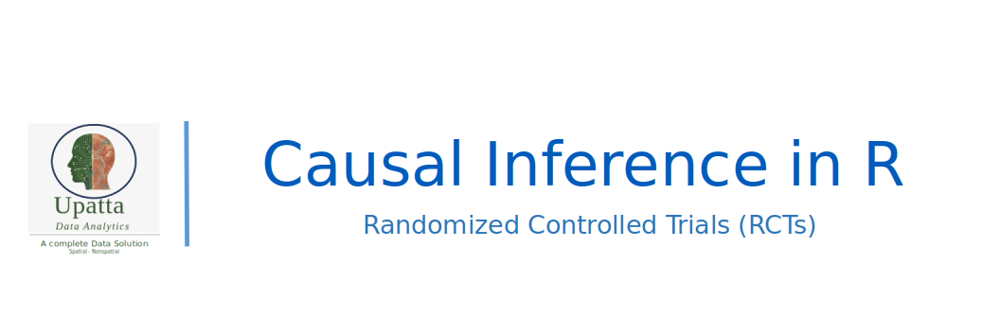

[{fig-align="left" width="150"}](https://github.com/zia207/Causal_Inference_R/blob/main/Notebook/02_08_01_00_randomized_controlled_trials_introduction_r.ipynb)

{fig-align="left" width="1400"}

# 1. Randomized Controlled Trials (RCTs) {.unnumbered}

Randomized Controlled Trials (RCTs) serve as the foundation for causal inference in medicine, public health, social sciences, and policy evaluation. By randomly assigning participants to treatment or control groups, RCTs remove systematic differences between groups at baseline, isolating the effect of an intervention from confounding variables. This process ensures that, on average, any observed differences in outcomes are attributable to the treatment rather than to pre-existing characteristics.

This tutorial guides you through designing, analyzing, visualizing, and reporting Randomized Controlled Trials (RCTs) using the R programming language. Whether you are conducting a clinical trial, an educational experiment, or a policy field test, R offers a robust, reproducible, and open-source environment for each stage of the RCT workflow, including randomization, power analysis, intention-to-treat (ITT) estimation, per-protocol analysis, and subgroup exploration.

## Theoretical Foundations

The validity of RCTs rests on three core principles:

1.  **Random Assignment**: Participants are allocated to treatment conditions by chance (e.g., coin flip, computer-generated sequence). This breaks the link between potential confounders (observed or unobserved) and treatment status, satisfying the **ignorability assumption**:

$$
   (Y(1), Y(0)) \perp T
$$

where $Y(1)$ and $Y(0)$ are potential outcomes and \$T) is treatment assignment.

2.  **Control Group**: A comparison group that does not receive the active intervention (may receive placebo, standard care, or nothing). This enables estimation of the **counterfactual**—what would have happened to the treated group in the absence of treatment.

3.  **Blinding (Masking)**: When feasible, participants, providers, and/or outcome assessors are unaware of group assignment to reduce performance and detection bias.

The primary causal estimand in most RCTs is the **Average Treatment Effect (ATE)**:

$$
\text{ATE} = \mathbb{E}[Y(1) - Y(0)]
$$

Under randomization, the ATE is unbiasedly estimated by the simple difference in mean outcomes between treatment and control groups.

## How RCTs Work: Key Stages

A well-conducted RCT follows a structured pipeline:

1.  **Design Phase**
    -   Define hypothesis, population, intervention, and primary outcome\
    -   Choose randomization scheme (simple, block, stratified, cluster)\
    -   Conduct **power analysis** to determine required sample size
2.  **Randomization**
    -   Generate allocation sequence ensuring balance and reproducibility\
    -   Conceal allocation to prevent selection bias
3.  **Implementation**
    -   Deliver intervention per protocol\
    -   Track adherence, dropouts, and protocol deviations
4.  **Analysis**
    -   **Intention-to-Treat (ITT)**: Analyze participants based on *assigned* group (preserves randomization benefits)\
    -   **Per-Protocol (PP)**: Analyze only those who complied with the protocol (risks bias but estimates efficacy)\
    -   **As-Treated / Instrumental Variable**: Alternative strategies for non-compliance
5.  **Reporting**
    -   Estimate treatment effects with confidence intervals\
    -   Assess balance in baseline covariates\
    -   Explore heterogeneity (subgroup analyses)\
    -   Visualize results (forest plots, coefficient plots, flow diagrams)

## Types of RCT Designs

| Design | Description | When to Use | R Considerations |
|-----------------|-----------------|-----------------|---------------------|
| **Parallel-group** | Participants assigned to one of two or more arms; followed over same period | Most common design | Standard t-tests, linear models |
| **Crossover** | Each participant receives all treatments in sequence (with washout) | Chronic stable conditions (e.g., hypertension) | Mixed-effects models (`lme4`) |
| **Factorial** | Tests two or more interventions simultaneously (e.g., Drug A × Drug B) | Efficient for studying interactions | Interaction terms in regression |
| **Cluster-Randomized** | Groups (e.g., clinics, villages) randomized, not individuals | Interventions applied at group level | Account for intra-cluster correlation (`lmer`, `survey`) |
| **Adaptive** | Trial design modified during enrollment based on interim results | Efficient resource use, ethical optimization | Requires specialized simulation & monitoring |

## Key R Packages for RCTs

R offers a rich ecosystem for designing and analyzing RCTs:

| Purpose | Package(s) |
|-------------------------------|-----------------------------------------|
| **Randomization** | `randomizeR`, `blockrand`, `randtoolbox`, `RCT` |
| **Power & Sample Size** | `pwr`, `WebPower` |
| **Balance Checking** | `tableone`, `cobalt` |
| **Primary Analysis** | Base R (`t.test`, `lm`, `glm`), `broom`, `emmeans` |
| **Mixed Models (Crossover/Cluster)** | `lme4`, `nlme` |
| **Visualization** | `ggplot2`, `forestplot`, `ggpubr`, `RCT` (for CONSORT-style flow diagrams) |
| **Compliance & IV Analysis** | `AER` (for instrumental variables in non-compliance settings) |

> **Tip**: The `RCT` package (by S. Jackman) provides utilities specifically for RCT workflows, including randomization, balance tables, and effect estimation.

## Summary

Randomized Controlled Trials remain the gold standard for establishing causality because randomization balances both known and unknown confounders across treatment groups. While conceptually simple, rigorous RCT implementation requires careful attention to design, execution, and analysis. R provides a comprehensive, transparent, and flexible platform to support every step—from generating reproducible randomization sequences to producing publication-ready tables and figures.

This tutorial will guide you through hands-on examples covering: - Simulating RCT data\
- Implementing different randomization schemes\
- Conducting ITT and subgroup analyses\
- Visualizing treatment effects and baseline balance\
- Reporting results in compliance with CONSORT guidelines

By the end, you’ll be equipped to design and analyze your own RCT—or critically evaluate one—using best practices in modern statistical computing.

## Further Resources

-   **Books**:
    -   *Design of Randomized Controlled Trials* – Schulz, Altman, & Moher (CONSORT Handbook)\
    -   *Clinical Trials: A Methodologic Perspective* – Piantadosi\
    -   *Practical Statistics for Medical Research* – Altman
-   **Guidelines**:
    -   [CONSORT Statement](https://www.consort-statement.org/) – Reporting standards for RCTs\
    -   FDA & EMA guidance on clinical trial design
-   **R Vignettes & Tutorials**:
    -   `randomizeR` vignette: “Randomization in Clinical Trials”\
    -   `rct` package documentation\
    -   `lme4` tutorials for crossover and cluster designs
-   **Online Courses**:
    -   Johns Hopkins: *Designing Clinical Trials* (Coursera)\
    -   Harvard Catalyst: *Introduction to RCTs*
