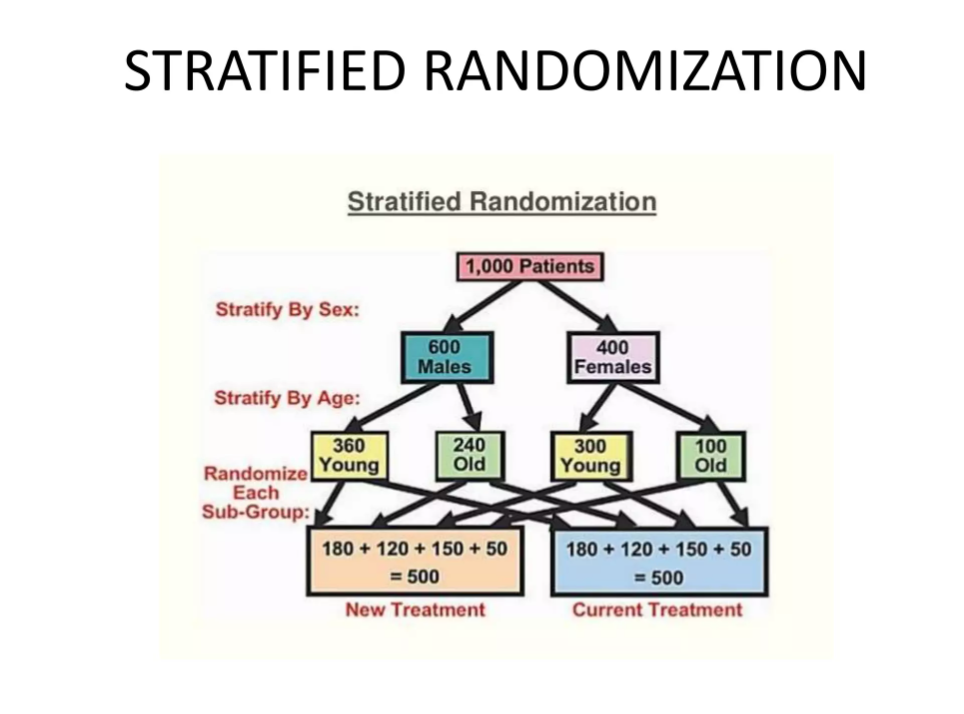

[{fig-align="left" width="150"}](https://github.com/zia207/Causal_Inference_R/blob/main/Notebook/02_08_01_02_randomized_controlled_trials_randomization_r.ipynb)

{fig-align="left" width="1400"}

# 1.2 Randomization of Randomized Controlled Trials (RCTs) {.unnumbered}

Randomization is the process of assigning participants in a study to different treatment arms using a chance mechanism. This ensures that each participant has a known probability of receiving each treatment, which helps eliminate selection bias and balances both known and unknown confounders across groups. This tutorial focuses on three common randomization schemes used in RCTs: simple randomization, block randomization, and stratified randomization. You will learn how to implement each scheme in R with practical examples.

##  Overview 

Randomization is the cornerstone of valid causal inference in RCTs. It ensures that—on average—treatment and control groups are comparable at baseline, balancing both known and unknown confounders.

However, **not all randomization is equal**. In small trials or multi-center studies, simple randomization can lead to **imbalance** in group sizes or key covariates. To address this, researchers use structured schemes:

| Scheme | Purpose | Best For |
|----------------------|-------------------------|-------------------------|
| **Simple** | Pure chance assignment | Large trials (N \> 200) |
| **Block** | Ensures balance over time | Small-to-medium trials |
| **Stratified** | Balances key prognostic factors | Multi-center or heterogeneous populations |

## Implementation in R

In this tutorial, you’ll learn how to implement all three in **R** using the `randomizeR` and `blockrand` packages, with reproducible examples.

### Setup and Load Libraries


```{r}
#| message: false
#| warning: false
packages <- c(
          'blockrand',
          'pwr',
          'randomizeR',
          'tidyverse'
)
```


``` r
#| warning: false
#| error: false

# Install missing packages
new_packages <- packages[!(packages %in% installed.packages()[,"Package"])]
if(length(new_packages)) install.packages(new_packages)
```


### Verify Installation

```{r}
# Verify installation
cat("Installed packages:\n")
print(sapply(packages, requireNamespace, quietly = TRUE))
```


### Load Packages

```{r}
#| warning: false
#| error: false
# Load packages with suppressed messages
invisible(lapply(packages, function(pkg) {
  suppressPackageStartupMessages(library(pkg, character.only = TRUE))
}))

```

### Check Loaded Packages

```{r}
# Check loaded packages
cat("Successfully loaded packages:\n")
print(search()[grepl("package:", search())])
```


## Types of Randomization

Here are the three main schemes we will cover:

### Simple Randomization

**Simple randomization** (also called complete randomization) is the most basic and straightforward method of assigning participants in a **randomized controlled trial (RCT)** or other experimental study to different groups (e.g., treatment vs. control).

Each participant has an **equal probability** of being assigned to any group, and assignments are made **independently** — with no restrictions, blocks, or stratification based on participant characteristics.

#### How It Works

It mimics classic random mechanisms: - Flipping a fair coin for each person (heads = treatment, tails = control). - Rolling a die (e.g., 1–3 = control, 4–6 = treatment). - Using a shuffled deck of cards. - Most commonly today: a computer-generated sequence of random numbers (e.g., via software like R, Python, or trial management systems).

The key feature is complete unpredictability — no one (researcher, participant, or staff) can guess the next assignment, which helps prevent selection bias and allocation bias.

#### Advantages

-   Extremely simple and easy to implement.
-   Maximizes unpredictability → strong protection against bias.
-   In large trials (typically n \> 200–300), it usually produces well-balanced groups in terms of sample size and baseline characteristics purely by chance.

#### Limitations

-   In **small trials**, chance imbalances can occur (e.g., one group ends up much larger, or key prognostic factors like age/sex are unevenly distributed).
-   No guarantee of equal group sizes at any point during recruitment.
-   For these reasons, more advanced methods (block randomization for balance in size, stratified randomization for balance in important covariates) are often preferred in smaller or high-stakes studies.

#### Quick Visual Example

Imagine enrolling 10 patients using simple randomization (coin flips):

Possible (but unlucky) outcome: 8 treatment, 2 control → severe imbalance.

In a large trial with 1,000 patients, such extremes become very unlikely, and groups tend to even out (around 500 each).

Simple randomization is the purest form of randomization and forms the foundation for understanding more sophisticated techniques — it's ideal when the trial is large enough that chance alone provides good balance.

## Simple Randomization in R


## Setup and Required Packages


```{r}
#| message: false
#| warning: false
packages <- c(
          'tidyverse',
          'pwr',
          'blockrand',
          'randomizeR'
)
```


``` r
#| warning: false
#| error: false

# Install missing packages
new_packages <- packages[!(packages %in% installed.packages()[,"Package"])]
if(length(new_packages)) install.packages(new_packages)
```


### Verify Installation

```{r}
# Verify installation
cat("Installed packages:\n")
print(sapply(packages, requireNamespace, quietly = TRUE))
```


### Load Packages

```{r}
#| warning: false
#| error: false
# Load packages with suppressed messages
invisible(lapply(packages, function(pkg) {
  suppressPackageStartupMessages(library(pkg, character.only = TRUE))
}))

```

### Check Loaded Packages

```{r}
# Check loaded packages
cat("Successfully loaded packages:\n")
print(search()[grepl("package:", search())])
```


We can implement simple randomization in R using the `sample()` function:

```{r}
n = 100  # Total number of participants
set.seed(123)  # Optional: for reproducible results
group <- sample(c("Treatment", "Control"), 
                size = n, 
                replace = TRUE, 
                prob = c(0.5, 0.5))

# 3. Check the results
table(group)      # Shows how many in each group
head(data.frame(ID = 1:n, Group = group))  # Preview assignments
```

We can also simulate a dataset and apply simple randomization:

```{r}
# Simulate a participant ID and baseline data
set.seed(456)
participants <- data.frame(
  ID = 1:120,
  Age = rnorm(120, mean = 55, sd = 10),
  Sex = sample(c("M", "F"), 120, replace = TRUE)
)

# Simple randomization
participants$Group <- sample(c("Treatment", "Control"), nrow(participants), replace = TRUE)

# Check group sizes
table(participants$Group)

# Optional: add a numeric column (1 = Treatment, 0 = Control)
participants$Treatment <- as.integer(participants$Group == "Treatment")
```

```{r}
set.seed(789)
participants %>%
  mutate(Group = sample(c("Treatment", "Control"), n(), replace = TRUE)) %>%
  count(Group)
```

The {`randomizeR`} package (available on CRAN) is an excellent specialized tool for implementing randomization in clinical trials, including simple randomization. It goes beyond base R by offering:

-   Generation of randomization sequences for many procedures (simple, block, stratified, etc.).
-   Built-in assessment of randomization quality (e.g., susceptibility to selection bias via correct guess probability).
-   Reproducible and auditable sequences suitable for trial protocols.

It's particularly useful in the design phase of `RCTs` when you want more than just basic assignment — like formal documentation or bias checks.

```{r}
set.seed(123)

# Define parameters for simple randomization (complete randomization)
# N = total sample size, groups = 2 (treatment vs control)
rar_par <- rarPar(N = 100, groups = c("Treatment", "Control"))

# Generate one randomization sequence (reproducible with seed)
set.seed(123)  # For reproducibility during planning
rand_seq <- genSeq(rar_par, 1)  # 1 = number of sequences to generate

# View the sequence (M = Treatment, U = Control by default; can be customized)
rand_seq

# Or get it as a factor/data frame
assignments <- getRandList(rand_seq)
head(assignments)  # Shows participant assignments

```

### Block Randomization

Block randomization (also called permuted block randomization) is a restricted randomization method used in randomized controlled trials (RCTs) to ensure that treatment groups stay balanced in size throughout the enrollment process — especially useful in small-to-moderate sized trials where simple randomization can produce chance imbalances (e.g., one group ending up with far more participants).

#### How It Works

Participants are enrolled in small groups called blocks of fixed size (e.g., 4, 6, or 8). Within each block:

-   The number of spots for each treatment arm is exactly equal (or in the desired ratio, like 2:1).
-   The assignments within the block are randomly permuted (shuffled).

Example: 2-arm trial (Treatment A vs. Control B), block size = 4

→ Each block must contain exactly 2 A and 2 B.

Possible permutations (randomly chosen):

-   AABB
-   ABAB
-   ABBA
-   BAAB
-   BABA
-   BBAA

As participants enroll sequentially, the next assignment comes from the current block's random permutation. Once a block is full, a new block starts. This guarantees that after every block (or multiple blocks), the group sizes are equal (or very close), preventing severe imbalances even early in recruitment.

#### Advantages Over Simple Randomization

-   Better balance in sample sizes at all stages → more precise estimates, especially in small trials (n \< 200–300).
-   Reduces risk of chance confounding if enrollment happens over time (e.g., seasonal changes in patient mix).
-   Improves statistical power by avoiding extreme group-size differences.

#### Main Disadvantage

-   Predictability risk: If the block size is fixed and known (or guessed), someone involved in enrollment might predict the last assignment in a block once the others are known → can introduce selection bias (e.g., holding back a "sicker" patient if they know the next spot is control).
-   Use random/variable block sizes (e.g., randomly choose between 4 and 6) — this makes prediction much harder while still providing balance.

#### When to Use It

-   Small or moderate-sized trials.
-   When group-size balance is important early on (e.g., multicenter trials, time-sensitive recruitment).
-   Often combined with stratification (stratified block randomization) to balance important prognostic factors like age or sex.

#### Block Randomization in R

Here is clean, ready-to-use R code for block randomization (permuted block randomization) using the two best packages: `blockrand` (easiest for most trials) and `randomizeR` (more formal with bias assessment).

R package `blockrand` is straightforward for generating block randomization lists with variable block sizes.

```{r}
# Install if needed
# install.packages("blockrand")
library(blockrand)

set.seed(2026)  # For reproducibility during testing; remove for real trial

# 120 participants, 2 arms (Treatment vs Control), 1:1 by default
my_blocks <- blockrand(
  n           = 120,
  num.levels  = 2,
  levels      = c("Treatment", "Control"),
  block.sizes = c(2, 4)
)

print("Object created successfully?")
print(exists("my_blocks"))              # Should be TRUE
print(names(my_blocks))                # id, block.id, block.size, treatment (NOT "arm")
print(nrow(my_blocks))                 # Should be 120
print(length(my_blocks$treatment))     # Should be 120
print(class(my_blocks$treatment))      # Should be "character"
print(head(my_blocks))                 # Show first rows
print(table(my_blocks$treatment))      # Should be ~60 Treatment, ~60 Control

```

```{r}
#  Now create the cumulative vectors
assignments <- my_blocks$treatment     # Use "treatment", not "arm"
cum_trt     <- cumsum(assignments == "Treatment")
cum_ctrl    <- cumsum(assignments == "Control")

# 5. Confirm lengths
print(length(assignments))             # 120
print(length(cum_trt))                 # 120
print(length(cum_ctrl))                # 120
```

You can visualize block balance over time

```{r}
#| fig.width: 6
#| fig.height: 5
# 6. Finally plot (only run after the above prints look good)
plot(1:length(assignments), cum_trt,
     type = "l", col = "blue", lwd = 2,
     xlab = "Patients Enrolled", ylab = "Cumulative Count",
     main = "Block Randomization Balance Over Time",
     ylim = c(0, max(cum_trt, cum_ctrl) + 5))

lines(1:length(assignments), cum_ctrl, col = "orange", lwd = 2)

legend("topleft", 
       legend = c("Treatment", "Control"),
       col = c("blue", "orange"),
       lwd = 2, bty = "n")
```

You can creates a pdf file of randomization cards using `plotblockrand()` function based on the output from blockrand. This file can then be printed and the cards put into envelopes for use by a study coordinator for assigning subjects to treatment.

```{r}
# Save the randomization list
# write.csv(my_blocks[, c("id", "treatment")], 
#           "block_randomization_list.csv", row.names = FALSE)

plotblockrand(my_blocks, file = "randomization_cards_test.pdf",
  top = list(text = c("My Trial", "Patient: %ID%", "Arm: %TREAT%"),
             col = c("black", "black", "red")),
  middle = "",
  bottom = "")

cat("PDF generated successfully\n")

```

```{r}
# Example: 2:1 ratio (more Treatment assignments)
my_blocks_2to1 <- blockrand(
  n           = 120,
  num.levels  = 3,                      # Total "slots" per full block cycle
  levels      = c("Treatment", "Treatment", "Control"),  # 2 Treatment : 1 Control
  block.sizes = c(3, 6),                # Block sizes must be multiples of num.levels (3)
  stratum     = "All"
)

table(my_blocks_2to1$arm)               # Expect ~80 Treatment, ~40 Control
```

We can also use the `randomizeR` package for more formal block randomization with bias assessment:

```{r}
# Define parameters for permuted block randomization
# bc = vector of block lengths (can repeat values for many blocks)
# Here: use blocks of size 2, 4, 6 repeatedly to cover ~120 patients
bc_vector <- rep(c(2, 4, 6), times = 15)  # Enough to cover >120; function uses as needed

pbr_params <- pbrPar(
  bc     = bc_vector,             # block lengths
  K      = 2,                     # number of groups
  ratio  = c(1, 1),               # 1:1 allocation
  groups = c("Trt", "Ctrl")       # group labels
)

# Now generate the sequence for N = 120
set.seed(2026)  # for reproducibility; remove for real trial
rand_sequence <- genSeq(pbr_params)

# View assignments
assignments <- getRandList(rand_sequence)
head(assignments)

# Summary counts
table(assignments)

# Optional: Assess susceptibility to selection bias
assess(rand_sequence, issue = corGuess("CS"))  # Correct guess probability

# Export
write.csv(data.frame(ID = 1:120, Group = assignments), 
          "pbr_randomization.csv", row.names = FALSE)
```

### Stratified Block Randomization

**Stratified block randomization** (also called **stratified permuted block randomization**) combines **stratification** and **block randomization** to achieve better balance in RCTs.

It first divides participants into **strata** (subgroups) based on important prognostic factors (e.g., sex, age category, disease severity, or study center) that strongly influence the outcome or response to treatment. Then, within **each stratum**, block (permuted block) randomization is applied separately to ensure balanced group sizes (treatment vs. control) within that subgroup.

This prevents imbalances in key baseline characteristics across treatment arms, which improves precision, reduces confounding, and increases statistical power—especially in smaller trials or when strata matter a lot.

Suppose a trial randomizes 1000 patients to a new treatment vs. standard care (1:1 ratio), stratifying by two factors: - Sex: Male or Female - Age: Young (\<50) or Old (≥50)

This creates **4 strata**:

1.  Male + Young
2.  Male + Old
3.  Female + Young
4.  Female + Old

Within each stratum, use permuted blocks (e.g., block size 4: exactly 2 treatment + 2 control per block, in random order like ABAB, BAAB, AABB, etc.).

Overall balance is achieved because:

-   Each stratum gets roughly equal allocation.
-   Within strata, blocks prevent large imbalances during enrollment.

From a standard epidemiology textbook example (Gordis, 2014), a simplified large-trial illustration shows:

{width="624"}

In this diagram: 

- Start with total patients.

- Stratify by sex → males/females. 

- Then by age within sex → young/old subgroups. 

- Randomize each subgroup separately → end up with \~500 in each arm, balanced across all strata.

#### Practical Small-Trial Example

Trial: 120 patients, 2 arms (Drug vs. Placebo), stratify by: - Prior biologic failure: Yes/No - Albumin level: Low (\<3.0) or Normal (≥3.0)

→ 4 strata.

Use block size 4 or variable (4/6/8) in each stratum separately. After 20 patients in one stratum, groups will be close to equal (e.g., 10 Drug, 10 Placebo) due to blocks, and prognostic factors remain balanced overall.

#### Advantages

-   Better baseline balance for known strong predictors.
-   More efficient analysis (less need for covariate adjustment).
-   Higher power in moderate/small trials.

#### Limitations

-   More complex to implement (separate lists per stratum).
-   If too many strata → small numbers per stratum → risk of imbalance or over-stratification.
-   Still some predictability risk (mitigated with variable block sizes).

#### Implementation of stratified randomization in R

Using {`blockrand`} (simple, produces randomization cards/PDF, great for trials)

```{r}
# Install if needed
# install.packages("blockrand")
library(blockrand)

# Example: Stratify by 2 factors → 4 strata
# - Sex: Male / Female
# - Site/Center: Site1 / Site2
# 2 arms (Treatment vs Control), 1:1 ratio
# Target ~50 per stratum (adjust as needed)
# Variable block sizes: 2 and 4 (to reduce predictability)

set.seed(2026)  # For reproducibility during planning; remove for real trial

# Stratum 1: Male + Site1
male_site1 <- blockrand(
  n          = 60,                # Slightly more to allow dropouts/extra
  num.levels = 2,
  levels     = c("Treatment", "Control"),
  block.sizes = c(2, 4),          # Randomly use blocks of 2 or 4
  stratum    = "Male_Site1"
)

# Stratum 2: Male + Site2
male_site2 <- blockrand(
  n          = 60,
  num.levels = 2,
  levels     = c("Treatment", "Control"),
  block.sizes = c(2, 4),
  stratum    = "Male_Site2"
)

# Stratum 3: Female + Site1
female_site1 <- blockrand(
  n          = 60,
  num.levels = 2,
  levels     = c("Treatment", "Control"),
  block.sizes = c(2, 4),
  stratum    = "Female_Site1"
)

# Stratum 4: Female + Site2
female_site2 <- blockrand(
  n          = 60,
  num.levels = 2,
  levels     = c("Treatment", "Control"),
  block.sizes = c(2, 4),
  stratum    = "Female_Site2"
)

# Combine into one master list (add ID prefix per stratum if desired)
all_assignments <- rbind(
  male_site1, male_site2, female_site1, female_site2
)

# After generating all strata...
table(male_site1$treatment)     # Now shows counts
table(female_site2$treatment)

# Full combined summary
table(all_assignments$treatment)

```

```{r}
all_assignments <- rbind(
  transform(male_site1,     id = paste0("M1_", id)),
  transform(male_site2,     id = paste0("M2_", id)),
  transform(female_site1,   id = paste0("F1_", id)),
  transform(female_site2,   id = paste0("F2_", id))
)

# Now safe unique IDs and correct column
table(all_assignments$treatment)
```

We can use randomizeR for stratified block randomization as well:

```{r}
# Install if needed (run once)
# install.packages("randomizeR")
library(randomizeR)

# Set seed for reproducibility during planning/testing
# Remove set.seed() line when generating the actual trial list
set.seed(2026)

# Define parameters for random permuted block randomization
params <- rpbrPar(
  N      = 120,                   # Total sample size (required here!)
  K      = 2,                     # Number of groups/arms
  rb     = c(2, 4, 6),            # Possible block sizes (randomly chosen each time)
  ratio  = c(1, 1),               # 1:1 allocation
  groups = c("Trt", "Ctrl")       # Group labels
)

# Generate the randomization sequence
rand_sequence <- genSeq(params)

# Extract assignments as a vector
assignments <- getRandList(rand_sequence)

# Quick checks
head(assignments)                  # First few assignments
length(assignments)                # Should be 120
table(assignments)                 # Should be very close to 60/60

# Export to CSV (ready for trial use)
write.csv(
  data.frame(ID = 1:120, Group = assignments),
  "random_permuted_block_randomization.csv",
  row.names = FALSE
)

# Optional: Check susceptibility to selection bias (correct guess probability)
assess(rand_sequence, issue = corGuess("CS"))

```

### Compare All Randomization Three Schemes

```{r}
#| fig.width: 8
#| fig.height: 8
#| 
set.seed(2026)  # For reproducibility; remove for real trial

N_total <- 120  # Total participants

# -----------------------------
# 1. Simple Randomization
# -----------------------------
simple_assign <- sample(c("Treatment", "Control"), size = N_total, replace = TRUE, prob = c(0.5, 0.5))
simple_df <- data.frame(
  ID = 1:N_total,
  Method = "Simple",
  Arm = simple_assign,
  Enrolled = 1:N_total
)
simple_cum <- simple_df %>%
  group_by(Enrolled) %>%
  mutate(Cum_Treatment = cumsum(Arm == "Treatment"),
         Cum_Control = cumsum(Arm == "Control"))

# -----------------------------
# 2. Block Randomization (Variable blocks for low predictability)
# -----------------------------
block_assign <- blockrand(
  n = N_total,
  num.levels = 2,
  levels = c("Treatment", "Control"),
  block.sizes = c(2, 4, 6)  # Variable sizes
)
block_df <- data.frame(
  ID = block_assign$id,
  Method = "Block",
  Arm = block_assign$treatment,
  Enrolled = 1:N_total
)
block_cum <- block_df %>%
  group_by(Enrolled) %>%
  mutate(Cum_Treatment = cumsum(Arm == "Treatment"),
         Cum_Control = cumsum(Arm == "Control"))

# -----------------------------
# 3. Stratified Block Randomization (2 strata example: Sex Male/Female)
# -----------------------------
# Stratum 1: Male (n=60)
male <- blockrand(n = 60, num.levels = 2, levels = c("Treatment", "Control"),
                  block.sizes = c(2, 4, 6), stratum = "Male")
# Stratum 2: Female (n=60)
female <- blockrand(n = 60, num.levels = 2, levels = c("Treatment", "Control"),
                    block.sizes = c(2, 4, 6), stratum = "Female")

strat_df <- rbind(
  transform(male,   ID = paste0("M_", id), Stratum = "Male"),
  transform(female, ID = paste0("F_", id), Stratum = "Female")
) %>%
  mutate(Enrolled = row_number(),
         Method = "Stratified Block",
         Arm = treatment)  # Column is 'treatment'

strat_cum <- strat_df %>%
  group_by(Enrolled) %>%
  mutate(Cum_Treatment = cumsum(Arm == "Treatment"),
         Cum_Control = cumsum(Arm == "Control"))

# -----------------------------
# Combine all for plotting
# -----------------------------
all_cum <- bind_rows(
  select(simple_cum, Enrolled, Method, Cum_Treatment, Cum_Control),
  select(block_cum,  Enrolled, Method, Cum_Treatment, Cum_Control),
  select(strat_cum,  Enrolled, Method, Cum_Treatment, Cum_Control)
)

# Pivot longer for ggplot
all_long <- all_cum %>%
  tidyr::pivot_longer(cols = c(Cum_Treatment, Cum_Control),
                      names_to = "Group", values_to = "Cumulative") %>%
  mutate(Group = gsub("Cum_", "", Group))

# -----------------------------
# Multi-panel visualization of balance over time
# -----------------------------
ggplot(all_long, aes(x = Enrolled, y = Cumulative, color = Group)) +
  geom_line(linewidth = 1) +
  facet_wrap(~ Method, ncol = 1, scales = "free_y") +  # One panel per method
  scale_color_manual(values = c("Treatment" = "blue", "Control" = "orange")) +
  labs(title = "Cumulative Balance Over Time: Comparison of Randomization Schemes",
       x = "Patients Enrolled Sequentially",
       y = "Cumulative Count in Group",
       color = "Group") +
  theme_minimal() +
  theme(legend.position = "bottom",
        strip.text = element_text(size = 12, face = "bold"),
        plot.title = element_text(hjust = 0.5, size = 14))

# Optional: Save plot
ggsave("randomization_balance_comparison.png", width = 8, height = 10, dpi = 300)
```

Above Plot Shows (Expected Behavior):

-   `Simple`: Lines may diverge noticeably early (e.g., one arm leads by 10+), then even out by chance in larger N.
-   `Block`: Lines stay very close (deviations ≤ half block size), with small "resets" at block ends — tight parallel climb.
-   `Stratified Block`: Similar to block but even tighter within strata; overall balance excellent if strata are balanced.

### Best Practices & Recommendations

| Situation | Recommended Scheme |
|-------------------------|-----------------------------------------------|
| Large trial (N \> 200) | Simple |
| Small trial (N \< 100) | Block (size 4 or 6) |
| Multi-center trial | Stratified + Block (by site) |
| Known strong prognostic factor (e.g., disease stage) | Stratified by that factor |
| Adaptive trial with interim looks | Block (to avoid bias at stopping) |

### How to Choose Block Sizes

Block sizes should be:

-   Multiples of number of arms (e.g., for 1:1, use even numbers like 2,4,6,8).
-   Small for more frequent balance (e.g., 2–4: resets often, max imbalance ≤2) but higher predictability risk.
-   Variable/random (e.g., c(2,4,6) or c(4,6,8)) recommended — balances well while minimizing bias (most guidelines suggest this for modern trials).
-   Rule of thumb:
-   Small trials (n\<100): Start with 2–6.
-   Moderate (n=100–300): 4–8.
-   Include at least 2 sizes differing by ≥2.
-   Avoid fixed large blocks if concealment is critical.
-   Test in simulation: Run the code above multiple times (change seed) to check average max imbalance.

### Additional Tips

-   **Always set a seed** for reproducibility.
-   **Conceal allocation**: In real trials, use a secure system (not just R code!).
-   **Document your scheme** in the protocol and CONSORT flow diagram.
-   For complex designs (e.g., unequal allocation, covariate-adaptive), consider `randomizeR::generateRandomization()` with custom objectives.

## Summary and Conclusion

This tutorial covered three key randomization schemes for RCTs—simple, block, and stratified randomization—and how to implement each in R using the `randomizeR` and `blockrand` packages. Here is a quick comparison:

| Scheme | Pros | Cons | R Function |
|-----------------|-----------------|-----------------|---------------------|
| **Simple** | Easy, transparent | Risk of imbalance | `sample()` or `randomizeR::simple` |
| **Block** | Guaranteed balance | Predictable sequence (risk of selection bias if not concealed) | `randomizeR::block` |
| **Stratified** | Balances key subgroups | Requires larger N per stratum | Combine `group_by()` + block randomization |

By choosing the right randomization scheme—and implementing it correctly in R—you ensure your RCT has the strongest possible foundation for causal inference.

## Resources

-   **Packages**:
    -   [`randomizeR`](https://cran.r-project.org/package=randomizeR): Comprehensive randomization methods\
    -   [`blockrand`](https://cran.r-project.org/package=blockrand): Simple block randomization\
-   **Guidelines**:
    -   CONSORT Statement: [www.consort-statement.org](https://www.consort-statement.org/)\
    -   FDA Guidance on Clinical Trial Design\
-   **Books**:
    -   *Fundamentals of Clinical Trials* (Friedman et al.)\
    -   *Designing Clinical Research* (Hulley et al.)
