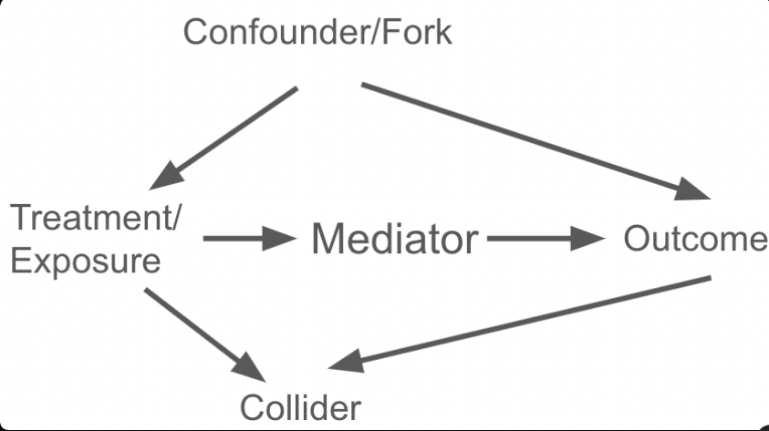

[{fig-align="left" width="150"}](https://github.com/zia207/Causal_Inference_R/blob/main/Notebook/02_08_02_00_graphical_models_introduction_r.ipynb)

{fig-align="left" width="1400"}

# 2. Directed Acyclic Graphs (DAGs) {.unnumbered}

**Directed Acyclic Graphs (DAGs)** are a class of graphical models that use nodes and directed edges (arrows) to represent variables and their causal or probabilistic relationships, subject to the constraint that the graph contains **no directed cycles**. They play a central role in **causal inference**, especially in the modern framework associated with Judea Pearl and others.

##  Overview 

DAGs are non-parametric representations—they encode qualitative causal structure without specifying functional forms (linear, nonlinear, etc.). Thes are foundational in the framework developed by Judea Pearl and others. They encode assumptions about the data-generating process based on domain knowledge, theory, or expert insight. The absence of an arrow between two variables implies no direct causal link (though indirect links may exist). DAGs allow us to reason about causality using graph theory rather than just statistical associations, distinguishing correlation from causation.

A **Directed Acyclic Graph (DAG)** is a graph $G=(V,E)$ with:

### Nodes

**Nodes** $V={X_1,\dots,X_p}$: variables (observed or latent).

-   Stand for **random variables**, observed or unobserved (latent).
-   In causal DAGs, nodes are interpreted under hypothetical **interventions** (i.e., well-defined actions on variables).

### Directed Edges

**Directed edges** $E \subseteq V \times V$: arrows $X_i \to X_j$ indicating hypothesized direct causal effects.

-   $X \to Y$ means $X$ is a direct cause of $Y$ (holding other parents of $Y$ fixed).
-   **Absence of an edge** asserts **no direct causal effect** (a strong, theory-based assumption).

### Acyclicity

-   **Acyclicity**: no directed cycles (i.e., there is no path $X \to \cdots \to X$ that returns to its start).

A DAG implies a **partial order**—causes precede effects. DAGs are **non-parametric**: they encode qualitative causal structure, not functional forms (linear/nonlinear) or effect sizes.

DAGs underpin the modern framework of causal inference associated with Judea Pearl and colleagues. They help translate domain knowledge into explicit assumptions about the data-generating process, enabling principled identification strategies.

### Structural Causal Models (SCMs) and Markov Factorization

DAGs are typically interpreted via **Structural Causal Models (SCMs)**:

$$
X\_i = f\_i\big(\text{Pa}(X\_i), U\_i\big),
$$

where $$\text{Pa}(X\_i)$$ are the **parents** (direct causes) of $X_i$, $f_i$ is a (possibly stochastic) function, and $U_i$ are exogenous disturbances. Under standard causal sufficiency (or by explicitly adding latent nodes for shared causes), the errors are independent.

The **Causal Markov Property** and **Markov Factorization** state:

$$
P(X_1,\dots,X_p) ;=; \prod_{i=1}^p P\left(X_i \mid \text{Pa}(X_i)\right).
$$

This factorization encodes conditional independencies implied by the DAG (assuming **faithfulness**—no coincidental cancellations of independencies).

### Conditional Independence via d-Separation

**d-Separation** is a graphical test for (conditional) independence:

> Two nodes $X$ and $Y$ are d-separated by a set $Z$ if **all** paths between $$X$$ and $$Y$$ are **blocked** by $Z$.

**Canonical path motifs**:

1.  **Chain**: $X \to M \to Y$ (or $X \leftarrow M \leftarrow Y$)

– Path is **blocked by conditioning on** $M$.

2.  **Fork (confounder)**: $X \leftarrow C \to Y$

– Path is **blocked by conditioning on** $C$.

3.  **Collider**: $X \to C \leftarrow Y$

– Path is **blocked by default**; **conditioning on the collider** $C$ (or a **descendant** of $C$) **opens** the path.

Under the Markov + faithfulness assumptions, d-separation corresponds to statistical (conditional) independence relations testable in the observed distribution.

### Interventions, the do-Operator, and Truncated Factorization

An **intervention** $do(X=x)$ forcibly sets $X$ to $x$, **breaking** its natural causes. Graphically, we **remove incoming arrows into** $$X$$.

**Truncated factorization** gives the post-intervention distribution:

$$
P(v \mid do(X=x)) ;=; \prod_{V_i \neq X} P\left(v_i \mid \text{Pa}(V_i)\right)\Big|_{X=x}.
$$

In general, $P(Y \mid do(X=x)) \neq P(Y \mid X=x)$, because conditioning differs from intervening (conditioning leaves incoming arrows intact; intervening cuts them).

### Bias, Confounding, and Adjustment

#### Confounders

A variable $C$ is a confounder for the effect of $X$ on $Y$ if it **causes both** $X$ and $Y$: $X \leftarrow C \to Y$. Failing to adjust for $C$ induces bias via **backdoor paths**.

#### Backdoor Paths

A **backdoor path** from $X$ to $Y$ is any path that **enters** $X$ with an arrow (i.e., starts with $\cdots \to X$ or $\cdots \leftarrow X$ but the first edge adjacent to $X$ points **into** $X$). Backdoor paths are **non-causal** routes that induce spurious associations.

#### Backdoor Criterion

A set $Z$ suffices for adjustment if:

1.  $Z$ **blocks all backdoor paths** from $X$ to $Y$, and
2.  $Z$ contains **no descendants of** $X$ (to avoid post-treatment bias).

Then:

$$
P(Y \mid do(X=x)) ;=; \sum_{z} P(Y \mid X=x, Z=z),P(Z=z)
$$

(or the integral analog for continuous $Z$). This requires **positivity/overlap** and **consistency** assumptions in addition to the graphical criteria.

**Avoid** conditioning on:

-   **Colliders** (opens spurious paths; selection bias/Berkson’s paradox).
-   **Mediators** if estimating **total** (not direct) effects.
-   **Descendants of** $X$ (post-treatment variables), which can introduce bias.

### Frontdoor Criterion (Identification with Unmeasured Confounding)

When backdoor adjustments are impossible (e.g., unobserved $U$ confounds $X \leftrightarrow Y$), **frontdoor adjustment** may identify the effect via a mediator $M$ if:

1.  All directed paths from $X$ to $Y$ go through $M$ (no unmediated effect).
2.  There is **no unblocked backdoor** from $X$ to $M$.
3.  There is **no unblocked backdoor** from $M$ to $Y$ after conditioning on $X$.

Then:

$$
P(Y \mid do(X=x))
= \sum_{m} P(m \mid X=x) ;\sum_{x'} P(Y \mid m, x'),P(x').
$$

This is valuable when a latent $U$ confounds $X$ and $Y$ but does **not** confound $X \to M$ or $M \to Y$.

### Common Pitfalls: Colliders and Selection Bias

**Collider bias** arises when conditioning on a variable $S$ that is a common effect:

$$
X \to S \leftarrow Y.
$$

Conditioning on $S$ (or its descendant) **induces correlation** between $X$ and $Y$ even if none existed—classic **selection bias**/**Berkson’s paradox**. Similarly, conditioning on **post-treatment** variables (descendants of $X$) can distort causal effect estimates.

### Identifiability, Do-Calculus, and Equivalence

#### Identifiability

A causal estimand (e.g., $P(Y\mid do(X))$) is **identifiable** from observed data and the DAG if it can be expressed in terms of the observed distribution $P(V)$ using valid graphical rules. Main tools:

-   **Backdoor criterion** (confounding control).
-   **Frontdoor criterion** (mediated identification under unmeasured confounding).
-   **Do-calculus** (three rules) for more complex graphs.

If no valid adjustment or transformation exists, the effect is **not identifiable** without stronger assumptions or experimental data.

#### Markov Equivalence

Different DAGs can encode the **same** set of (conditional) independencies—they form a **Markov equivalence class**, represented by a CPDAG (partially directed acyclic graph). Data alone often cannot distinguish the direction of certain edges; **domain knowledge** is essential.

### DAGs vs. Traditional Regression

| Aspect | Regression (as commonly used) | DAGs |
|------------------------|------------------------|------------------------|
| Focus | Association | Causation |
| Assumptions | Often implicit | Explicit (graphical) |
| Bias diagnosis | Limited | Systematic via paths |
| Variable selection | Data-driven (risk of bias) | Theory-driven (via DAG) |
| Model specification | Risk of over/under-control | Guided by backdoor/frontdoor |

**Key message**: DAGs precede modeling—use them to decide **what to adjust for** (and what *not* to), then fit appropriate statistical estimators.

### DAGs for Survival and Time-Varying Treatment

Time-to-event analyses frequently involve **time-varying confounding** affected by prior treatment. Represent this with longitudinal DAGs:

$$
L_0 \to A_0 \to L_1 \to A_1 \to \cdots \to Y
$$

with additional arrows $A_t \to L_{t+1}$ and potential confounding $L_t \to A_t, Y$.

In such settings, naive regression adjustment can be biased. DAGs clarify why **g-methods** are needed:

-   **G-formula** (parametric g-computation)
-   **Marginal Structural Models (MSMs)** with **IPTW**
-   **G-estimation** of Structural Nested Models

These methods emulate interventions across time consistent with the DAG’s structure (no cycles, clear temporal ordering), accommodating measured time-varying confounding affected by prior treatment.

### Backdoor Criterion and Frontdoor Criterion

To identify the causal effect of X on Y (e.g., $P(Y \| do(X)$)), we need to adjust for variables that eliminate bias while preserving causal paths.

-   **Backdoor Criterion**: A set of variables Z satisfies the backdoor criterion relative to X and Y if:

1.  Z blocks all **backdoor paths** (paths from X to Y with an arrow into X, i.e., non-causal paths starting backward from X).
2.  No variable in Z is a descendant of X (to avoid post-treatment bias or blocking causal paths).

If Z satisfies this, the causal effect is identifiable by conditioning on Z (e.g., via stratification, regression adjustment, matching, or IPW). This blocks confounding by closing all non-causal backdoor paths without opening new ones.

Example: If there's a confounder C (X ← C → Y), conditioning on C blocks the backdoor path.

-   **Frontdoor Criterion**: When backdoor paths cannot be blocked (e.g., due to unobserved confounders U, like X ← U → Y), but there is a mediator M such that:

1.  X → M → Y (frontdoor path).
2.  No unobserved confounder affects both X and M.
3.  No unobserved confounder affects both M and Y.
4.  M intercepts all directed paths from X to Y.

Then the effect is identifiable by adjusting for M (frontdoor adjustment), even if direct backdoor confounding exists. A classic example is smoking (X) → tar deposit (M) → lung cancer (Y), with unobserved genotype (U) confounding smoking and cancer; conditioning on tar identifies the effect.

### A Small Worked Example

[{width="393"}

-   **Backdoor confounding**: $U$ (unobserved) and $C$ (observed) both cause $X$ and $Y$.
-   **Mediator**: $M$ lies on the path $X \to M \to Y$.
-   **Collider**: $S$ is a common effect of $X$ and $Y$.

**Goal**: Identify the **total effect** of $X$ on $Y$.

-   **Do not** adjust for $M$ (blocks causal effect) or $S$ (collider; induces bias).
-   If $U$ is unobserved, **backdoor** via $U$ remains open—backdoor adjustment with $C$ alone is **insufficient**.
-   If frontdoor conditions hold for $M$ (i.e., $U$ does not confound $X\to M$ nor $M\to Y$ given $X$, and $M$ intercepts all $X\to Y$ paths), you can use the **frontdoor formula**.
-   Otherwise, the effect is **not identifiable** from purely observational data.

**Estimating a total effect when identifiable**:

-   If all confounders of $X\to Y$ are observed (say only $C$ and no $U$), a minimal sufficient adjustment set is ${C}$:

$$
P(Y \mid do(X=x)) = \sum\_c P(Y \mid X=x, C=c) P(C=c).
$$ - Never include $S$ (collider) or $M$ (mediator) for total effects.

### Practical Workflow

1.  **State the question** and define the estimand (total effect, controlled direct effect, natural effects, etc.).
2.  **Draw the DAG** from domain knowledge (include plausible unobserved variables; be explicit about timing).
3.  **List all paths** from treatment $X$ to outcome $Y$.
4.  **Classify** each path: directed (causal), backdoor (non-causal), colliders, mediators.
5.  **Choose an adjustment set** that blocks all backdoors and avoids post-treatment/colliders. If impossible, check frontdoor or do-calculus.
6.  **Pick an estimator** consistent with your choice (e.g., regression with appropriate covariates, matching, IPW, g-formula, doubly robust estimators).
7.  **Check assumptions**: positivity/overlap, SUTVA/consistency, model specification; conduct sensitivity analyses for unmeasured confounding.
8.  **Report transparently**: show the DAG, justify exclusions/inclusions, and document identifiability logic.

**Tools**:

-   **DAGitty** (web): draw DAGs and obtain minimal sufficient adjustment sets.
-   **R**: `dagitty`, `ggdag`, `causaleffect`.
-   **Python**: `pgmpy` (graphical models), emerging causal libraries.

### Applications

-   **Epidemiology & Biostatistics**: confounding control, mediation, selection bias, transportability.
-   **Economics & Policy**: program evaluation, instrumental variables, frontdoor opportunities.
-   **Social Sciences**: selection mechanisms, collider pitfalls in survey designs.
-   **Machine Learning**: causal discovery (PC, GES, FCI), causal representation learning, fairness.
-   **Clinical & Survival Analysis**: DAGs for time-varying exposures and confounders (see below).

### Limitations and Good Practices

-   **Model dependence**: DAGs reflect **assumptions**; misspecification yields wrong conclusions.
-   **Equivalence classes**: Data alone may not orient edges; rely on theory and temporality.
-   **Unmeasured confounding**: If unavoidable, use sensitivity analyses, instruments, negative controls, or leverage frontdoor where justified.
-   **Measurement error**: Represent it explicitly (error nodes) and consider its implications for identifiability.
-   **Positivity**: Ensure overlap; violations undermine identification even with correct DAG logic.

### Quick Reference: What to Adjust For

-   **Confounders (common causes)**: **Yes** (block backdoors).
-   **Mediators**: **No** for **total effects**; **Yes** when estimating **direct effects** (with care).
-   **Colliders**: **No** (and avoid their descendants).
-   **Post-treatment variables**: **No** for total effects.
-   **Instruments** (valid IVs): **No** as covariates for total effects (can increase bias if invalid).

### Key Takeaways

-   DAGs encode **causal assumptions**; they are **not** automatic discovery of truth.
-   **d-Separation** links graph structure to (conditional) independence in data.
-   **Interventions** are different from conditioning; use **do-operator** logic.
-   DAGs guide **what to adjust for** (and **what not to**) to identify causal effects.
-   When backdoors can’t be blocked, consider **frontdoor** or **do-calculus**.
-   For **time-varying** problems, use **g-methods** motivated by longitudinal DAGs.

## Summary and Conclusion

Directed Acyclic Graphs (DAGs) provide a rigorous, non-parametric language for encoding causal assumptions and guiding valid statistical adjustment. By making assumptions explicit through nodes and directed edges, DAGs help researchers distinguish confounding from mediation, diagnose collider bias, and apply identification tools such as the backdoor criterion, frontdoor criterion, and do-calculus. When standard adjustment fails—due to unmeasured confounding or time-varying treatment–confounder feedback—DAGs motivate alternative strategies including g-methods. Mastering DAGs is essential for translating domain knowledge into defensible causal inference.

## Resources

`1. Foundational Texts`
- Pearl, J. (2009). *Causality: Models, Reasoning, and Inference* (2nd ed.). Cambridge University Press.  
  *The definitive treatment of DAGs and causal calculus, including frontdoor criterion derivation*
- Hernán, M. A., & Robins, J. M. (2020). *Causal Inference: What If*. Boca Raton: Chapman & Hall/CRC.  
  *Practical guide to DAGs, g-methods, and implementation in epidemiology (freely available at [www.hsph.harvard.edu/miguel-hernan/causal-inference-book](https://www.hsph.harvard.edu/miguel-hernan/causal-inference-book))*

`2. Key Papers on Frontdoor Criterion`

- Pearl, J. (1995). ["Causal diagrams for empirical research"](https://doi.org/10.1093/biomet/82.4.669). *Biometrika*, 82(4), 669–688.  
  *Original derivation of frontdoor criterion*
- Glymour, M. M., et al. (2022). ["Frontdoor adjustment in environmental epidemiology"](https://doi.org/10.1289/EHP10245). *Environmental Health Perspectives*, 130(5), 057001.  
  *Application to air pollution studies with biomarker validation*

`3. Packages & Documentation`

- **dagitty**: [cran.r-project.org/package=dagitty](https://cran.r-project.org/package=dagitty)  
  *Core DAG operations and adjustment set derivation*
- **ggdag**: [cran.r-project.org/package=ggdag](https://cran.r-project.org/package=ggdag)  
  *Publication-quality DAG visualization*
- **ipw**: [cran.r-project.org/package=ipw](https://cran.r-project.org/package=ipw)  
  *Inverse probability weighting for MSMs*
- **EValue**: [cran.r-project.org/package=EValue](https://cran.r-project.org/package=EValue)  
  *Sensitivity analysis for unmeasured confounding*
- **ltmle**: [cran.r-project.org/package=ltmle](https://cran.r-project.org/package=ltmle)  
  *Longitudinal targeted maximum likelihood estimation for time-varying confounding*

`4. Interactive Tools`

- **DAGitty Web App**: [www.dagitty.net](https://www.dagitty.net)  
  *Interactive DAG construction, adjustment set derivation, and R code export*
- **Causal Diagram App**: [shiny.ihmp.org/causal-diagrams](https://shiny.ihmp.org/causal-diagrams)  
  *Educational tool for exploring bias structures*

`5. Environmental Health Applications`

- Wu, X., et al. (2022). ["Short-term exposure to wildfire smoke and hospital admissions in California"](https://doi.org/10.1056/NEJMoa2111313). *New England Journal of Medicine*, 387(15), 1371–1380.  
  *Time-varying confounding in wildfire smoke studies*
- Patel, M. M., et al. (2023). ["Personal exposure monitoring breaks confounding in traffic pollution studies"](https://doi.org/10.1289/EHP11876). *Environmental Health Perspectives*, 131(3), 037002.  
  *Frontdoor-like identification using wearable sensors*

`6. Tutorials & Courses`

- **Harvard Chan School Causal Inference Curriculum**: [www.hsph.harvard.edu/miguel-hernan/causal-inference-book](https://www.hsph.harvard.edu/miguel-hernan/causal-inference-book)  
  *Free online textbook with R/Stata code*
- **Causal Inference Bootcamp (Johns Hopkins)**: [www.coursera.org/learn/causal-inference](https://www.coursera.org/learn/causal-inference)  
  *Practical implementation of DAGs and g-methods*
- **dagitty.net Tutorials**: [www.dagitty.net/learn](https://www.dagitty.net/learn)  
  *Step-by-step DAG construction and analysis*

