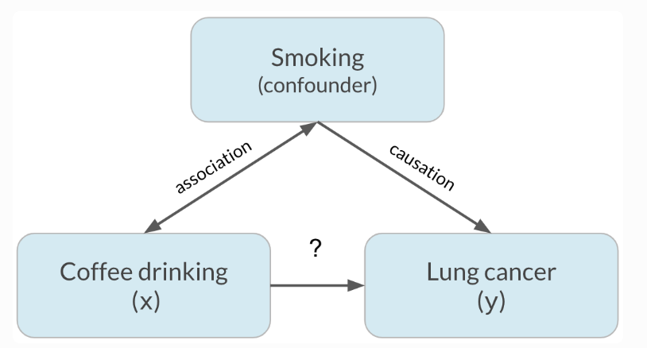
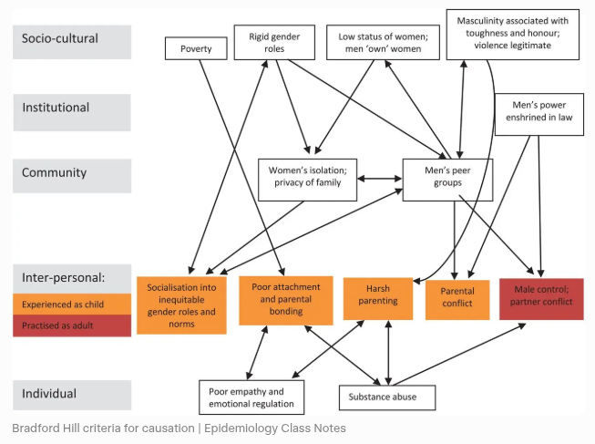

[{fig-align="left" width="150"}](https://github.com/zia207/R_Beginner/blob/main/Notebook/01_01_00_getting_started_introduction_r.ipynb)

{fig-align="left" width="1400"}

# Causal Inference in R: From Theory to Practice {.unnumbered}

Causal inference is a scientific discipline focused on estimating the effects of interventions, treatments, or policies on outcomes of interest. It addresses questions such as “What would happen if X were changed?” rather than simply examining associations with X. In contrast to predictive modeling, which aims to minimize forecasting error, causal inference requires explicit reasoning about counterfactuals, considering what the outcome would have been for the same unit under alternative treatment conditions.

The foundational framework for modern causal inference is the **potential outcomes model** (also known as the Rubin Causal Model). For each unit $i$, we define two potential outcomes:

-   $Y_i(1)$: the outcome if unit $i$ receives treatment
-   $Y_i(0)$: the outcome if unit $i$ does not receive treatment

The **individual treatment effect** is $Y_i(1) - Y_i(0)$, but we only ever observe one of these outcomes—the other remains *counterfactual*. This is the **Fundamental Problem of Causal Inference**.

::: callout-note
## Fundamental Problem of Causal Inference

We can never observe both potential outcomes for the same unit at the same time. Consequently, we estimate *average* effects over populations rather than individual effects.
:::

Consequently, we estimate *average* effects over populations, such as the **Average Treatment Effect (ATE)**:

$$
\text{ATE} = \mathbb{E}[Y(1) - Y(0)]
$$

or the **Average Treatment Effect on the Treated (ATT)**:

$$
\text{ATT} = \mathbb{E}[Y(1) - Y(0) \mid D = 1]
$$

where $D$ is the binary treatment indicator.

To identify these quantities from observational data, we must make untestable assumptions—most critically, **conditional unconfoundedness** (or ignorability):

$$
(Y(1), Y(0)) \perp D \mid X
$$

meaning that, conditional on observed covariates $X$, treatment assignment is as good as random. Additional assumptions include **overlap** ($0 < P(D=1 \mid X) < 1$) and **consistency** (the observed outcome equals the potential outcome under the assigned treatment).

A complementary perspective uses **Directed Acyclic Graphs (DAGs)** to encode structural assumptions about relationships among variables. DAGs help identify confounders, colliders, and mediators, and guide the application of graphical criteria like the **backdoor criterion** to select valid adjustment sets.

## Key Concepts in Causal Inference

### Correlation vs. Causation: Understanding the Difference

Correlation describes a statistical association between two variables, indicating that they tend to vary together in a consistent pattern. An increase in one variable may correspond with an increase in the other (positive correlation) or a decrease (negative correlation). However, this relationship is observational and does not explain the underlying reason for the association. In contrast, causation asserts that a change in one variable directly produces or leads to a change in the other. Establishing causation requires substantially more rigorous evidence than merely observing that two events occur simultaneously.

A well-known real-world example demonstrates this distinction. Observational studies have indicated that individuals who consume large amounts of coffee appear to have higher rates of lung cancer. This observation might initially suggest that coffee consumption harms the lungs. However, the relationship is largely spurious. The actual causal factor is smoking; individuals who smoke cigarettes, which contain carcinogens that significantly increase lung cancer risk, also tend to drink more coffee as part of their lifestyle. Smoking serves as a confounding variable, influencing both coffee consumption and lung cancer risk, and thereby creating the illusion of a direct association. When researchers control for smoking, either by comparing only non-smokers or by statistically adjusting for smoking history, the apparent link between coffee and lung cancer largely disappears. Smoking causes lung cancer, whereas coffee consumption is only correlated with it due to its shared association with smoking behavior.

Several visual examples further clarify this principle. A classic diagram demonstrates how a confounding variable can create the illusion of causation between two variables that are actually unrelated once the third factor is considered:

{width="431"}

This example reinforces a fundamental principle in science and statistics: correlation may indicate a relationship, but it does not provide sufficient evidence of causation. Researchers should consider alternative explanations, particularly the presence of confounding variables, before drawing causal inferences.

### Bradford Hill criteria

The Bradford Hill criteria constitute a foundational framework in epidemiology for evaluating whether an observed statistical association between an exposure, such as smoking or a pollutant, and an outcome, such as lung cancer or another disease, is indicative of a true causal relationship rather than mere correlation or coincidence. Introduced in 1965 by British epidemiologist and statistician Sir Austin Bradford Hill in his seminal paper "The Environment and Disease: Association or Causation?", these criteria are not rigid rules or a mandatory checklist. Hill characterized them as nine "viewpoints" or considerations to be thoughtfully applied when interpreting an observed association as potential evidence of causation. The criteria were built upon earlier concepts and were instrumental in establishing the causal relationship between cigarette smoking and lung cancer.

The nine criteria are:

1.  **Strength** – Large effect sizes are less likely to be due to confounding.
2.  **Consistency** – The association is observed in different populations, times, and study designs.
3.  **Specificity** – A cause leads to a single effect (though this is often not required for multifactorial diseases).
4.  **Temporality** – The cause must precede the effect (a *necessary* condition for causation).
5.  **Biological Gradient** – Dose–response relationship (more exposure → greater effect).
6.  **Plausibility** – Mechanistic coherence with current biological knowledge.
7.  **Coherence** – The causal claim should not contradict known facts.
8.  **Experiment** – Evidence from natural or controlled experiments (e.g., RCTs).
9.  **Analogy** – Similar cause–effect relationships lend support (e.g., thalidomide → birth defects → supports other drug teratogenicity).

Here is a clear visual overview of the nine classic Bradford Hill viewpoints, presented in a helpful infographic format that lists them with brief explanations:

{width="529"}

**Relationship to Modern Causal Inference**

-   The Bradford Hill criteria are **heuristic**, not formal statistical tools. They complement—but do not replace—rigorous causal frameworks like the **potential outcomes model** or **DAGs**.
-   **Temporality** aligns with the need for time-ordering in causal DAGs.
-   **Consistency** and **experiment** map onto replication and RCTs—the gold standard.
-   **Biological gradient** resembles monotonicity or dose–response assumptions in causal models.
-   However, modern causal inference emphasizes **identifiability assumptions** (e.g., unconfoundedness) and **quantitative estimation**, whereas Bradford Hill focuses on **qualitative judgment**.

### Confounding

Bias arising when a third variable influences both treatment and outcome, creating a spurious association. A **confounder** must:\
1. Be a cause (or proxy) of the treatment,\
2. Be a cause (or proxy) of the outcome, and\
3. Not lie on the causal pathway between treatment and outcome.

### Collider

A variable that is jointly caused by two other variables (e.g., $A \rightarrow C \leftarrow B$). Conditioning on a collider induces non-causal association between its causes (e.g., Berkson’s paradox).

### Mediator

A variable that lies on the causal pathway from treatment to outcome (e.g., Drug → Blood Pressure → Heart Attack). Mediation analysis decomposes total effects into direct and indirect components.

### Effect Modification (Interaction)

When the magnitude of a treatment effect differs across levels of a third variable (e.g., drug works better in women than men). Distinct from mediation—effect modifiers are not on the causal path.

### Potential Outcomes (Neyman–Rubin Causal Model)

For each unit $i$, define:

-   $Y_i(1)$: outcome if treated\
-   $Y_i(0)$: outcome if untreated

Only one is observed; the other is *counterfactual*. Causal effects are defined as contrasts (e.g., (Y(1) - Y(0))).

### Counterfactual

The unobserved outcome under a different treatment condition — what *would have* happened to a unit under a different treatment assignment. The counterfactual is the foundation of individual-level causal reasoning and the reason we can never directly observe an individual treatment effect.

### Directed Acyclic Graph (DAG)

A visual representation of causal assumptions:\
- **Nodes**: variables\
- **Arrows**: direct causal effects\
Used to identify confounders, colliders, mediators, and valid adjustment strategies.

### Structural Causal Model (SCM)

A system of equations describing data-generating mechanisms, often used with Pearl’s *do*-calculus to derive causal effects from observational data.

### Key Causal Effects

| Term | Definition | Formula |
|------------------|-------------------------------|-----------------------|
| **Average Treatment Effect (ATE)** | Average effect across entire population | (\mathbb{E}\[Y(1) - Y(0)\]) |
| **Average Treatment Effect on the Treated (ATT)** | Effect among those who received treatment | (\mathbb{E}\[Y(1) - Y(0) \mid T=1\]) |
| **Conditional Average Treatment Effect (CATE)** | Effect conditional on covariates (X) | (\mathbb{E}\[Y(1) - Y(0) \mid X\]) |
| **Local Average Treatment Effect (LATE)** | Effect for "compliers" in IV settings | (\mathbb{E}\[Y(1) - Y(0) \mid \text{complier}\]) |

### Ignorability (Unconfoundedness)

Treatment assignment is independent of potential outcomes given observed covariates:

$$
(Y(1), Y(0)) \perp T \mid X
$$

::: callout-important
This assumption **cannot be tested from data** — it must be justified by subject-matter knowledge and careful study design.
:::

### Overlap (Common Support / Positivity)

Every unit has non-zero probability of receiving either treatment:

$$
0 < P(T=1 \mid X=x) < 1 \quad \forall x
$$ Ensures comparable groups; violated when propensity scores approach 0 or 1.

### Consistency

Observed outcome matches the potential outcome under assigned treatment:

$$
Y = T \cdot Y(1) + (1 - T) \cdot Y(0)
$$

Requires a well-defined, single version of treatment (linked to SUTVA).

### SUTVA (Stable Unit Treatment Value Assumption)

Two parts:

1.  **No interference**: One unit’s treatment doesn’t affect another’s outcome\
2.  **No hidden versions**: Treatment is consistently defined across units

### Backdoor Criterion

A set $X$ satisfies the backdoor criterion for estimating $P(Y \mid \text{do}(T))$ if:

1.  No node in $X$ is a descendant of $T$, and\
2.  $X$ blocks all backdoor paths (paths from $T$ to $Y$ starting with an arrow into $T$).

→ If satisfied, adjust for $X$:

$$
P(Y \mid \text{do}(T)) = \sum_x P(Y \mid T, x) P(x)
$$

### Frontdoor Criterion

A mediator $M$ satisfies the frontdoor criterion if:

1.  $M$ intercepts all directed paths from $T$ to $Y$,\
2.  No unblocked backdoor path from $T$ to $M$, and\
3.  All backdoor paths from $M$ to $Y$ are blocked by $T$.

→ Enables identification even with unmeasured confounding between $T$ and $Y$:

$$
P(Y \mid \text{do}(T)) = \sum_m P(m \mid T) \sum_{t'} P(Y \mid m, t') P(t')
$$

### Common Methods

| Method | Purpose | Key Assumption |
|------------------|------------------|-----------------------------------|
| **Randomized Controlled Trial (RCT)** | Gold standard for causality | Randomization ensures ignorability |
| **Propensity Score** | Summarizes confounding into (e(X) = P(T=1 \mid X)) | Ignorability given (X) |
| **Inverse Probability Weighting (IPW)** | Reweights to mimic randomization | Correct propensity model + overlap |
| **Doubly Robust Estimator** | Consistent if outcome *or* propensity model is correct | At least one model correctly specified |
| **Instrumental Variable (IV)** | Addresses unmeasured confounding | Valid instrument (relevance, exclusion, independence) |
| **Difference-in-Differences (DiD)** | Uses time + group comparison | Parallel trends in absence of treatment |
| **Causal Forest** | Estimates heterogeneous effects (CATE) | Consistency, overlap, honest splitting |

### Balance Check

Assess covariate similarity between groups post-adjustment (e.g., standardized mean difference \< 0.1).

### Sensitivity Analysis

Quantify how results change under violations of key assumptions (e.g., unmeasured confounding).

### E-value

Minimum strength of association an unmeasured confounder would need to explain away the observed effect.

### Placebo Test

Apply treatment assignment to a pre-treatment outcome or fake outcome; should yield null effect if assumptions hold.

### Common Pitfalls & Biases

| Term | Description |
|-------------------------|-----------------------------------------------|
| **Post-treatment Bias** | Conditioning on a post-treatment variable (mediator or collider) that opens biasing paths. |
| **M-bias** | Spurious association induced by adjusting for a collider that creates a backdoor path. |
| **Ecological Fallacy** | Inferring individual-level causation from group-level associations. |
| **Time-Varying Confounding** | When a confounder is affected by past treatment (requires g-methods like MSMs). |
| **Selection Bias** | Systematic differences due to non-random participation or attrition (often involves colliders). |

### Paradoxes in Causal Inference

| Paradox | Cause | Resolution |
|-----------------------|------------------|-------------------------------|
| **Simpson’s Paradox** | Aggregation over a confounder reverses trend | Adjust for confounder using backdoor criterion |
| **Berkson’s Paradox** | Conditioning on a collider induces association | Avoid conditioning on colliders (e.g., hospital admission) |
| **Lord’s Paradox** | Disagreement between change-score vs. ANCOVA analysis | Clarify causal role of baseline (confounder vs. mediator) via DAG |

### Intention-to-Treat (ITT)

Analyze participants based on *assigned* treatment. Preserves randomization benefits; estimates *effectiveness*.

### Per-Protocol (PP)

Analyze only those who adhered to protocol. Risks selection bias; estimates *efficacy* under ideal conditions.

### Transportability

Generalizing causal effects from a study population to a target population (requires shared effect modifiers).

## Causal Inference Methods

Causal inference aims to estimate the effect of a treatment, intervention, or exposure on an outcome while accounting for confounding and other biases. Unlike standard statistical modeling—which often focuses on association—causal inference requires explicit assumptions about data-generating processes and counterfactual reasoning. Below are the methods used in causal inference, broadly categorized by approach:

### Randomized Controlled Trials (RCTs)

-   **Gold standard** for causal inference.
-   Participants are randomly assigned to treatment or control groups, ensuring that, on average, confounders are balanced.
-   Randomization breaks the link between potential confounders and treatment assignment, satisfying the **ignorability assumption** by design.

::: callout-warning
## Limitation

RCTs are often impractical, unethical, or prohibitively expensive in real-world settings (e.g., you cannot randomly assign people to smoke). Observational methods are frequently the only viable option.
:::

### Graphical Models (Directed Acyclic Graphs – DAGs)

-   Visual tools to encode causal assumptions about relationships among variables.
-   Help identify **confounders**, **colliders**, and **mediators**.
-   Used with the **backdoor criterion** or **frontdoor criterion** to determine which variables to adjust for.
-   Implemented in R via `dagitty` and `ggdag`.

### Potential Outcomes Framework (Neyman–Rubin Causal Model)

-   Provides the theoretical foundation for defining causal effects (e.g., ATE, ATT) using counterfactuals.
-   Not a method per se, but underlies most modern causal techniques.
-   Requires assumptions: **ignorability**, **overlap**, and **consistency**.

### Regression Adjustment

-   Include confounders as covariates in a regression model (e.g., linear or logistic).
-   Simple but sensitive to model misspecification and functional form assumptions.

### Propensity Score Methods

Estimate the probability of receiving treatment given covariates $X$: $e(X) = P(T=1 \mid X)$.

-   **Matching**: Pair treated and control units with similar propensity scores (`MatchIt`).
-   **Stratification**: Compare outcomes within propensity score bins.
-   **Inverse Probability Weighting (IPW)**: Weight units by $1/e(X)$ or $1/(1-e(X))$ to create a pseudo-population where treatment is independent of $X$.
-   **Covariate Balancing Propensity Scores (CBPS)**: Optimize balance directly.

### Doubly Robust Estimators

-   Combine outcome modeling and propensity weighting (e.g., **Augmented Inverse Probability Weighting (AIPW)** or **Targeted Maximum Likelihood Estimation – TMLE**).
-   Consistent if *either* the outcome model *or* the propensity model is correctly specified.
-   Packages: `tmle`, `drgee`, `causalweight`.

### G-Methods (for Time-Varying Treatments & Confounders)

Used when treatments and confounders evolve over time (e.g., in longitudinal studies).

-   **Marginal Structural Models (MSMs)** with inverse probability weighting (IPW)
-   **G-computation (G-formula)**
-   **Structural Nested Models**
-   Implemented in R via `ltmle`, `ipw`, or custom code.

### Instrumental Variable (IV) Analysis

-   Addresses **unmeasured confounding** by using an instrument $Z$ that:

1.  Affects treatment $T$\
2.  Does not affect outcome $Y$ except through $T$\
3.  Is independent of unmeasured confounders\

-   Common in econometrics (e.g., using distance to clinic as an instrument for treatment access).\

-   Methods: Two-stage least squares (2SLS), LIML.\

-   R packages: `AER::ivreg`, `ivmodel`.

### Difference-in-Differences (DiD)

-   Compares changes in outcomes over time between a treatment group and a control group.
-   Relies on the **parallel trends assumption**: in the absence of treatment, both groups would have followed the same trajectory.
-   Extensions: Event-study designs, staggered DiD.
-   R packages: `did`, `fixest`, `broom`.

### Regression Discontinuity Design (RDD)

Treatment is assigned according to whether a running variable crosses a cutoff threshold (e.g., test score ≥ 70). Units just above and below the threshold are assumed to be otherwise comparable, allowing causal effect estimation at the cutoff.

### Machine Learning–Enhanced Causal Inference

CausalML combines causal inference with modern ML to estimate treatment effects, answer “what if” questions, and support better decisions than correlation-based models.

### Core Categories & Popular Methods

**Meta-Learners** (ATE / CATE / ITE estimation)\
- S-Learner\
- T-Learner\
- X-Learner (often most efficient)\
- R-Learner / DR-Learner (doubly robust)

**Tree-based & Ensemble Methods** (heterogeneous effects)\
- Causal Forests / Generalized Random Forests\
- Uplift Trees / Uplift Forests\
- Causal Trees

**Double/Debiased Machine Learning**\
- Double ML (orthogonalized, √n-consistent)\
- Extensions: Bayesian Double ML, TMLE

**Deep Learning Approaches**\
- Deep IV\
- Dragonnet\
- CEVAE\
- Causal Representation Learning

**Causal Discovery & SCMs**\
- PC algorithm\
- GES / FGES\
- LiNGAM

**Emerging Areas**\
- Causal Reinforcement Learning\
- Causal Fairness\
- Conformal Prediction for causal uncertainty

Main libraries: **CausalML** (Uber), **EconML** (Microsoft), **DoubleML**, **DoWhy**.

These methods enable reliable causal reasoning in high-dimensional and observational settings.

### Mediation and Path Analysis

-   Decomposes total effect into **direct** and **indirect** (mediated) effects.
-   Requires strong assumptions (no unmeasured mediator-outcome confounding).
-   R package: `mediation`.

### Summary Table

| Method | Best For | Key Assumption |
|-------------------|-------------------|----------------------------------|
| RCT | Gold-standard experiments | Randomization |
| Propensity Score Matching | Observational binary treatment | Unconfoundedness, overlap |
| IPW / TMLE | Marginal effects, robustness | Correct propensity or outcome model |
| IV | Unmeasured confounding | Valid instrument |
| DiD | Panel data, policy evaluation | Parallel trends |
| Synthetic Control | Single-unit intervention | Convex combination of controls |
| Causal Forests | Heterogeneous effects, ML | Consistency, overlap |

These methods form a toolkit that researchers select based on data structure, assumptions, and research question. In practice, **triangulation**—using multiple methods to test robustness—is strongly recommended.

## Causal Inference in Survival Analysis

In many applications—such as clinical trials, epidemiology, or reliability engineering—the outcome of interest is *time until an event* (e.g., death, failure, recovery). Standard survival models (e.g., Cox proportional hazards) estimate associations but do not automatically yield causal effects unless assumptions are carefully addressed.

Causal survival analysis aims to estimate quantities like the **causal hazard ratio** or the **difference in survival curves** under treatment vs. control. Key challenges include:

-   Time-varying treatments and confounders
-   Censoring mechanisms that may depend on covariates
-   Violations of the proportional hazards assumption

Methods include:

-   **Inverse Probability of Treatment Weighting (IPTW)** for time-varying treatments (e.g., using `ipw` or `ltmle`)
-   **Marginal Structural Models (MSMs)** to estimate population-average effects
-   **G-formula** for dynamic treatment regimes

*Example*: In HIV research, one might ask: “Does initiating antiretroviral therapy (ART) at CD4 count \>500 cells/μL reduce mortality compared to delaying until \<350?” Here, CD4 count is a time-varying confounder affected by prior treatment—requiring MSMs or g-methods for valid inference.

## Temporal Causal Inference

Standard causal inference methods — regression, propensity score matching, inverse probability weighting — were designed for a static world: one treatment, one outcome, measured once. This framework breaks down whenever treatment, confounders, and outcomes co-evolve across time, which is the rule rather than the exception in clinical, economic, and environmental research.

Three structural problems make cross-sectional methods inadequate for temporal data. First, **reverse causation**: when both treatment and outcome are measured repeatedly, their temporal ordering becomes ambiguous — health affects income and income affects health, simultaneously — making it impossible to state a causal question without specifying a time horizon. Second, **time-varying confounding**: confounders are not static; they shift in response to both past treatment and past outcome, requiring adjustment at every time point rather than at baseline alone. Third, and most consequentially, the **feedback loop problem**: a time-varying confounder $L_t$ can simultaneously be a *consequence* of past treatment $A_{t-1}$ and a *cause* of future treatment $A_t$ and outcome $Y_{t+1}$. This creates a mediator-confounder dilemma that standard regression cannot resolve — adjusting for $L_t$ removes confounding but blocks an indirect causal path; not adjusting leaves confounding intact. The bias is structural and persists regardless of how many covariates are included. G-methods (the G-formula, marginal structural models, G-estimation) were developed specifically to resolve this dilemma by targeting marginal rather than conditional potential outcome means.

Temporal causal inference addresses these problems by indexing every variable by its measurement time, drawing temporal DAGs to make causal structure explicit, and selecting estimators matched to the specific data structure — panel, time series, repeated cross-sections, survival, or interrupted time series — and the specific estimand of interest.

## Causal Inference in Machine Learning

Machine learning (ML) excels at prediction but often lacks built-in mechanisms for causal identification. However, recent advances integrate ML flexibility with causal rigor: - **Double/debiased machine learning** (Chernozhukov et al., 2018) uses cross-fitting and orthogonalization to estimate ATE with high-dimensional controls while preserving √n-consistency. - **Causal forests** (Wager & Athey, 2018) extend random forests to estimate heterogeneous treatment effects (CATE). - **Meta-learners** (e.g., S-, T-, X-, R-learners) combine supervised learners to approximate counterfactual functions.

These methods are especially valuable when:

-   The number of covariates is large relative to sample size
-   Nonlinearities and interactions are present
-   Policy decisions require personalized treatment rules

*Example*: A digital health platform wants to know whether sending a reminder notification increases user engagement. With millions of users and hundreds of behavioral features, a causal forest can estimate who benefits most—enabling targeted interventions.

## Causal Inference in R

R offers a mature, open-source ecosystem specifically designed for transparent, reproducible causal analysis. Its functional programming style integrates seamlessly with modern data workflows (`tidyverse`), while specialized packages implement state-of-the-art methods—from classical propensity score techniques to machine learning–enhanced estimators. Visualization tools (`ggplot2`, `ggdag`) aid in communicating assumptions and results, and R Markdown enables literate programming for full auditability. Moreover, R’s statistical rigor aligns with the inferential nature of causal questions, providing standard errors, confidence intervals, and sensitivity diagnostics out of the box.

### List of Key R Packages for Causal Inference

| Purpose                       | Package(s)                               |
|-------------------------------|------------------------------------------|
| DAGs & graphical models       | `dagitty`, `ggdag`, `pcalg`, `bnlearn`   |
| Propensity scores & matching  | `MatchIt`, `Matching`, `optmatch`        |
| Balance assessment            | `cobalt`                                 |
| Inverse probability weighting | `ipw`, `WeightIt`                        |
| Doubly robust & TMLE          | `tmle`, `ltmle`, `drgee`, `causalweight` |
| Heterogeneous effects         | `grf` (Generalized Random Forests)       |
| Instrumental variables        | `AER`, `ivmodel`, `ivreg`                |
| Difference-in-differences     | `did`, `fixest`, `broom`                 |
| Mediation                     | `mediation`                              |
| Synthetic controls            | `Synth`, `gsynth`                        |
| Sensitivity analysis          | `EValue`, `rbounds`                      |
| Causal discovery              | `causalDisco`, `SID`                     |

::: callout-tip
## Practical Advice

In practice, **triangulate** across methods: use multiple approaches to test robustness. No single method is foolproof — the strength of causal claims comes from convergence of evidence under different assumptions.
:::

## Summary

Causal inference transforms observational data into actionable evidence—but only when assumptions are explicit, methods are appropriate, and diagnostics are rigorous. R provides a comprehensive toolkit to implement, validate, and communicate causal analyses across diverse domains.

By the end of this tutorial, you will be able to:

-   Distinguish between association and causation using formal frameworks
-   Construct and interpret DAGs to encode causal assumptions
-   Estimate causal effects using matching, weighting, and outcome modeling
-   Diagnose violations of key assumptions (e.g., lack of overlap, residual confounding)
-   Extend causal reasoning to time-to-event and machine learning contexts
-   Report findings with appropriate uncertainty quantification and visualizations

## Recommended Resources

-   **Books**:
    -   *Causal Inference: The Mixtape* – Scott Cunningham (free online)
    -   *Causal Inference: What If* – Hernán & Robins
    -   *Mostly Harmless Econometrics* – Angrist & Pischke
-   **Online Courses**:
    -   Harvard’s PH259x (edX)
    -   Stanford’s Causal Inference MOOC (Brady Neal)
-   **R Vignettes & Tutorials**:
    -   `MatchIt` and `cobalt` official vignettes
    -   `grf` documentation with real-world examples
    -   `dagitty` web interface + R integration guide
-   [Causal Inference in R](https://www.r-causal.org)
